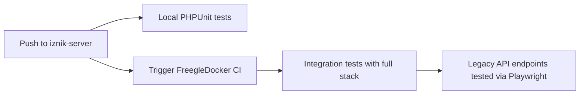

# CircleCI Continuous Integration

This repository uses CircleCI for continuous integration testing of the legacy PHP API server.

## Local CI Testing

This repository runs **comprehensive PHPUnit tests** in its own CircleCI environment:

### Test Suite
- **PHPUnit Tests**: Full test suite covering API endpoints, models, and services
- **Database Integration**: Tests run against MySQL 8.0, Redis 7.0, and PostgreSQL 12
- **External Services**: Includes Beanstalkd for queue testing
- **Coverage Reporting**: Code coverage with Xdebug (when enabled)

### Test Environment
```yaml
Services:
  - PHP 8.1 with Node.js
  - MySQL 8.0 (test database)
  - Redis 7.0 (cache testing)
  - PostgreSQL 12 with PostGIS (geolocation testing)
  - Beanstalkd (queue testing)

Environment Variables:
  - STANDALONE=TRUE
  - NO_UNMAPPED_TO_PENDING=TRUE  
  - XDEBUG_MODE=coverage
```

### Test Categories
- **API Tests** (`test/ut/php/api/`): HTTP endpoint testing
- **Include Tests** (`test/ut/php/include/`): Core business logic testing
- **Integration Tests**: Cross-service functionality validation

## Integration Testing

**End-to-end integration tests run in the [FreegleDocker repository](https://github.com/Freegle/FreegleDocker), not here.**

### Why Separate Integration Testing?
- **Complete System Testing**: Tests PHP API alongside Go API, databases, and frontends
- **Production-Like Environment**: Full Docker Compose stack mirrors production
- **Playwright Validation**: End-to-end user workflow testing
- **Cross-Service Integration**: Tests interaction between all Freegle components

### Automated Triggering

When you push changes to this repository:

1. **Runs Local Tests**: PHPUnit tests execute in this repository's CircleCI
2. **Triggers Integration Tests**: GitHub Actions webhook triggers FreegleDocker testing  
3. **Full System Validation**: Complete Docker Compose environment tests your changes



## Webhook Configuration

This repository includes `.github/workflows/trigger-parent-ci.yml` that automatically triggers FreegleDocker testing.

### Setup Requirements
The webhook requires a `CIRCLECI_TOKEN` secret in this repository:

1. **Get Token**: CircleCI → Personal API Tokens
2. **Add Secret**: Repository Settings → Secrets and Variables → Actions  
3. **Name**: `CIRCLECI_TOKEN`
4. **Value**: Your CircleCI API token

### Webhook Status
✅ **Active** - Pushes to `master` automatically trigger FreegleDocker integration testing

## Testing Approach

**Local PHPUnit Tests (This Repository):**
- API endpoint logic testing
- Database operations and migrations
- Email processing and routing
- User authentication and authorization  
- Message processing and spam detection
- Group management and moderation
- Payment processing and donations
- Location and mapping functionality

**Integration Tests (FreegleDocker):**
- Full HTTP request/response cycle testing
- Cross-service communication validation
- Database integration with realistic data
- Email delivery testing via MailHog
- Image processing pipeline testing
- Performance testing under load

## Running Tests Locally

### Preferred Test Execution (Most Reliable)
```bash
# API tests with teamcity output:
php /var/www/iznik/composer/vendor/phpunit/phpunit/phpunit \
  --configuration /var/www/iznik/test/ut/php/phpunit.xml \
  --filter sessionAPITest \
  --test-suffix sessionTest.php \
  /var/www/iznik/test/ut/php/api \
  --teamcity

# Include tests with teamcity output:  
php /var/www/iznik/composer/vendor/phpunit/phpunit/phpunit \
  --configuration /var/www/iznik/test/ut/php/phpunit.xml \
  --filter chatRoomsTest \
  --test-suffix chatRoomsTest.php \
  /var/www/iznik/test/ut/php/include \
  --teamcity
```

### Alternative Methods
```bash
# Run specific test class:
php composer/vendor/phpunit/phpunit/phpunit \
  --configuration test/ut/php/phpunit.xml \
  --filter sessionTest test/ut/php/api/

# Run specific test method:
php composer/vendor/phpunit/phpunit/phpunit \
  --configuration test/ut/php/phpunit.xml \
  --filter sessionTest::testGoogle test/ut/php/api/
```

## Environment Variables

CircleCI requires these environment variables for external service integration:
```bash
# Database connections
MYSQL_HOST=127.0.0.1
MYSQL_USER=root  
MYSQL_PASSWORD=iznik

# API keys (optional but recommended)
GOOGLE_CLIENT_ID=your_google_client_id
GOOGLE_CLIENT_SECRET=your_google_client_secret
GOOGLE_VISION_KEY=your_vision_key
MAPBOX_KEY=your_mapbox_key
```

## Monitoring & Results

### Local Test Results
- View results at: [CircleCI iznik-server](https://app.circleci.com/pipelines/github/Freegle/iznik-server)
- Artifacts include test reports and coverage data

### Integration Test Results
- View results at: [CircleCI FreegleDocker](https://app.circleci.com/pipelines/github/Freegle/FreegleDocker)  
- Includes Playwright HTML reports and full system logs

## Development Workflow

1. **Write PHP Code**: Implement API endpoints, models, services
2. **Add PHPUnit Tests**: Test individual components thoroughly
3. **Run Local Tests**: Use preferred test execution methods above
4. **Push Changes**: Triggers both local and integration testing
5. **Monitor Results**: Check both CircleCI dashboards for results

## Test Refactoring Guidelines

When modifying tests, follow these principles:
- Use utility methods from `IznikTestCase.php` and `IznikAPITestCase.php`
- Batch refactor similar patterns across multiple test files
- Test immediately after each refactored file
- Use data providers to reduce test duplication
- Be aggressive about fixing refactoring issues rather than reverting

## Related Documentation

- [PHP API Documentation](README.md)
- [PHPUnit Testing Guidelines](CLAUDE.md#phpunit-test-refactoring-approach)
- [FreegleDocker Integration Testing](https://github.com/Freegle/FreegleDocker/blob/master/CircleCI.md)
- [Full System Testing Guide](https://github.com/Freegle/FreegleDocker/blob/master/README.md#testing)